# AGENTS.md - High-Level Architecture & Operating Guidelines

This document defines the high-level architecture, operating guidelines, and non-negotiable invariants for AI agents working in the **Git & GitHub Practice Assignment** codebase.

---

## 1. System Workflows & Architecture

The system operates via two distinct, complementary workflows: **Student Workflow** and **Instructor Workflow**.

```mermaid
graph TD
    subgraph 1. Student Workflow
        S1[Fork Instructor Repo] --> S2[Clone Fork to Local Machine]
        S2 --> S3[Follow ASSIGNMENT_INSTRUCTIONS.md & Create Branches]
        S3 --> S4[Optional Local Test: python autograder.py]
        S4 --> S5[Push Branches to Fork on GitHub]
        S5 --> S6[Open PR via Web UI to Instructor Repo]
        S6 --> S7[GitHub Actions pr_evaluator.yml runs]
        S7 --> S8[Automated Markdown Table PR Comment]
    end

    subgraph 2. Instructor Workflow
        I1[Share Repo Link & Set Deadline] --> I2[Wait for Student PR Submissions]
        I2 --> I3[Run: python generate_class_reports.py]
        I3 --> I4[Generate: evaluation_reports/moodle_consolidated_grades.csv]
        I3 --> I5[Generate: evaluation_reports/moodle_student_feedback_comments.txt]
    end
```



---

### 🎓 1. Student Workflow

1. **Forking**: The student forks the official instructor repository ([`https://github.com/ClassroomAsignments/Git_GitHub-Practice-Asgnmt`](https://github.com/ClassroomAsignments/Git_GitHub-Practice-Asgnmt)).
2. **Local Cloning**: The student clones their forked repository onto their local development machine.
3. **Task Execution**: The student reads [`ASSIGNMENT_INSTRUCTIONS.md`](file:///E:/OneDrive%20-%20National%20University%20of%20Sciences%20&%20Technology/My%20Courses/Spring%2026/ASE-Sp26/LecDemoProjects/GitHub-Classroom/Git_GitHub-Practice-Asgnmt/ASSIGNMENT_INSTRUCTIONS.md) and creates one or more working branches (e.g. `feature/calculator`, `feature/conflict-fix`) to solve assignment tasks.
4. **Local Evaluation (Feedback Loop #1)**: The student can optionally test their grade locally at any time by running [`autograder.py`](https://github.com/ClassroomAsignments/Git_GitHub-Practice-Asgnmt/blob/main/autograder.py):
   ```bash
   python autograder.py
   ```
5. **Pushing to Fork**: The student commits and pushes their branch changes to their forked repository on GitHub.
6. **PR Creation & Automated PR Feedback (Feedback Loop #2)**:
   - The student opens a Pull Request (PR) via the GitHub Web UI from their fork against the instructor repository's `main` branch.
   - Opening or updating (`synchronize`) the PR triggers the GitHub Actions 2-workflow evaluation system ([`.github/workflows/autograder-runner.yml`](file:///.github/workflows/autograder-runner.yml) & [`.github/workflows/post-grades.yml`](file:///.github/workflows/post-grades.yml)).
   - `autograder-runner.yml` executes [`autograder.py`](https://github.com/ClassroomAsignments/Git_GitHub-Practice-Asgnmt/blob/main/autograder.py) (`python autograder.py --no-color > autograder_output.txt`) in a read-only sandbox, and `post-grades.yml` automatically posts (or updates in-place) an itemized markdown score table directly in the PR conversation comments.


---

### 👨‍🏫 2. Instructor Workflow

1. **Assignment Distribution**: The instructor distributes the repository link ([`https://github.com/ClassroomAsignments/Git_GitHub-Practice-Asgnmt`](https://github.com/ClassroomAsignments/Git_GitHub-Practice-Asgnmt)) to students and establishes a submission deadline.
2. **PR Collection**: Students submit and update their Pull Requests prior to the deadline.
3. **Automated Gradebook & Feedback Generation**: After the timeline expires, the instructor executes:
   ```bash
   python instructor_files/generate_class_reports.py
   ```
4. **Output Artifacts**: [`instructor_files/generate_class_reports.py`](file:///E:/OneDrive%20-%20National%20University%20of%20Sciences%20&%20Technology/My%20Courses/Spring%2026/ASE-Sp26/LecDemoProjects/GitHub-Classroom/Git_GitHub-Practice-Asgnmt/instructor_files/generate_class_reports.py) uses the GitHub REST API to fetch PR evaluation data and automatically outputs two files inside `evaluation_reports/`:
   - [`evaluation_reports/moodle_consolidated_grades.csv`](file:///E:/OneDrive%20-%20National%20University%20of%20Sciences%20&%20Technology/My%20Courses/Spring%2026/ASE-Sp26/LecDemoProjects/GitHub-Classroom/Git_GitHub-Practice-Asgnmt/evaluation_reports/moodle_consolidated_grades.csv): Formatted CSV for direct 1-click Moodle LMS grade import.
   - [`evaluation_reports/moodle_student_feedback_comments.txt`](file:///E:/OneDrive%20-%20National%20University%20of%20Sciences%20&%20Technology/My%20Courses/Spring%2026/ASE-Sp26/LecDemoProjects/GitHub-Classroom/Git_GitHub-Practice-Asgnmt/evaluation_reports/moodle_student_feedback_comments.txt): Itemized text feedback per student, organized by Student ID and Name, for easy copy-pasting into Moodle LMS feedback boxes.

---

## 2. Component Boundaries & Non-Negotiable Invariants

### 🔒 Confidentiality & Local Artifact Isolation
* **Instructor & Local Artifacts**: All instructor-only materials (`instructor_files/`), generated evaluation reports (`evaluation_reports/`), Antigravity AI metadata (`.gemini/`), and AI planning/walkthrough artifacts (`*_plan.md`, `walkthrough.md`) MUST remain strictly local to the instructor repository and listed in [`.gitignore`](file:///E:/OneDrive%20-%20National%20University%20of%20Sciences%20&%20Technology/My%20Courses/Spring%2026/ASE-Sp26/LecDemoProjects/GitHub-Classroom/Git_GitHub-Practice-Asgnmt/.gitignore) so they are never committed or exposed when students fork the official instructor repository.
* **Zero Disk Bloat**: [`instructor_files/generate_class_reports.py`](file:///E:/OneDrive%20-%20National%20University%20of%20Sciences%20&%20Technology/My%20Courses/Spring%2026/ASE-Sp26/LecDemoProjects/GitHub-Classroom/Git_GitHub-Practice-Asgnmt/instructor_files/generate_class_reports.py) MUST use GitHub REST API endpoints rather than cloning student repositories onto local disk.

### 🌿 Single Remote Branch Invariant & Tracked File Manifest
* **Single Remote Branch (`main`)**: The official instructor repository on GitHub MUST contain **only one branch (`main`)**. All temporary development branches MUST be deleted from GitHub after merging so students fork a completely clean repository.
* **Student-Facing Tracked File Manifest**: The repository on GitHub MUST contain ONLY the 15 student-relevant starter files:
  1. `.github/workflows/autograder-runner.yml`
  2. `.github/workflows/post-grades.yml`
  3. `.gitignore`
  4. `ASSIGNMENT_INSTRUCTIONS.md`
  5. `GITHUB_REFLECTION.md`
  6. `README.md`
  7. `RUBRIC.md`
  8. `app.py`
  9. `autograder.py`
  10. `calculator.py`
  11. `notes.txt`
  12. `src/app.py`
  13. `src/calculator.py`
  14. `src/notes.txt`
  15. `student_info.json`

### 🧪 Autograder Contract ([`autograder.py`](https://github.com/ClassroomAsignments/Git_GitHub-Practice-Asgnmt/blob/main/autograder.py))
* **Zero Dependencies**: [`autograder.py`](https://github.com/ClassroomAsignments/Git_GitHub-Practice-Asgnmt/blob/main/autograder.py) MUST run in standard Python 3.x without third-party library dependencies so students can run it locally without installation friction.
* **100-Point Rubric**: Evaluates 5 tasks worth 100 total points (Git config: 15, `.gitignore`: 15, feature branches: 25, merge conflicts: 25, tags: 20).

### 🤖 2-Workflow Evaluation System ([`.github/workflows/autograder-runner.yml`](file:///.github/workflows/autograder-runner.yml) & [`.github/workflows/post-grades.yml`](file:///.github/workflows/post-grades.yml))
* **Secure Sandbox Execution**: `autograder-runner.yml` executes untrusted student PR code under `pull_request` event with read-only permissions (`contents: read`) and uploads `autograder_output.txt` artifact via `actions/upload-artifact@v4`.
* **Privileged Comment Posting**: `post-grades.yml` triggers on `workflow_run` completion (`workflows: ["Autograder Runner"]`) in the base repository context with write permissions (`issues: write`, `pull-requests: write`) to download the artifact via `actions/download-artifact@v4` and post the **Itemized Markdown Grade Table Comment** directly on the student PR.
* **Clean Formatting Invariant**: All JavaScript scripts inside GitHub Actions workflow YAML files MUST use clean array joining (`commentLines.join('\n')`) rather than multiline template literals to prevent YAML syntax parsing errors or IDE lint warnings.
* **In-Place PR Updates**: Subsequent commits pushed to a student's PR update the existing comment in-place to avoid comment spam.


---

## 3. Directory & File Matrix

| File / Path | Purpose & Access Scope |
| :--- | :--- |
| [`ASSIGNMENT_INSTRUCTIONS.md`](file:///E:/OneDrive%20-%20National%20University%20of%20Sciences%20&%20Technology/My%20Courses/Spring%2026/ASE-Sp26/LecDemoProjects/GitHub-Classroom/Git_GitHub-Practice-Asgnmt/ASSIGNMENT_INSTRUCTIONS.md) | Student-facing assignment task guide. |
| [`autograder.py`](https://github.com/ClassroomAsignments/Git_GitHub-Practice-Asgnmt/blob/main/autograder.py) | Local & CI test suite (100 pts). |
| [`.github/workflows/autograder-runner.yml`](file:///.github/workflows/autograder-runner.yml) | GitHub Actions workflow that executes `autograder.py` on PRs and uploads output artifact. |
| [`.github/workflows/post-grades.yml`](file:///.github/workflows/post-grades.yml) | Privileged base-repo workflow that downloads output artifact and posts PR comment table. |
| [`instructor_files/generate_class_reports.py`](file:///E:/OneDrive%20-%20National%20University%20of%20Sciences%20&%20Technology/My%20Courses/Spring%2026/ASE-Sp26/LecDemoProjects/GitHub-Classroom/Git_GitHub-Practice-Asgnmt/instructor_files/generate_class_reports.py) | Instructor report generator for Moodle CSV and text feedback. |
| [`evaluation_reports/moodle_consolidated_grades.csv`](file:///E:/OneDrive%20-%20National%20University%20of%20Sciences%20&%20Technology/My%20Courses/Spring%2026/ASE-Sp26/LecDemoProjects/GitHub-Classroom/Git_GitHub-Practice-Asgnmt/evaluation_reports/moodle_consolidated_grades.csv) | Instructor local Moodle gradebook CSV (Ignored in `.gitignore`). |
| [`evaluation_reports/moodle_student_feedback_comments.txt`](file:///E:/OneDrive%20-%20National%20University%20of%20Sciences%20&%20Technology/My%20Courses/Spring%2026/ASE-Sp26/LecDemoProjects/GitHub-Classroom/Git_GitHub-Practice-Asgnmt/evaluation_reports/moodle_student_feedback_comments.txt) | Instructor local Moodle text feedback report (Ignored in `.gitignore`). |
| `instructor_files/` | Instructor confidential assets (Ignored in `.gitignore`). |
| `.gemini/` | Antigravity AI CLI configuration & session logs (Ignored in `.gitignore`). |
| [`.gitignore`](file:///E:/OneDrive%20-%20National%20University%20of%20Sciences%20&%20Technology/My%20Courses/Spring%2026/ASE-Sp26/LecDemoProjects/GitHub-Classroom/Git_GitHub-Practice-Asgnmt/.gitignore) | Protects instructor files & local outputs from git tracking. |
| [`AGENTS.md`](file:///E:/OneDrive%20-%20National%20University%20of%20Sciences%20&%20Technology/My%20Courses/Spring%2026/ASE-Sp26/LecDemoProjects/GitHub-Classroom/Git_GitHub-Practice-Asgnmt/AGENTS.md) | High-level system architecture and AI agent operating guidelines. |

---

## 4. Guidelines for AI Assistant Operations
1. **Preserve Invariants**: Ensure all edits maintain zero-disk API fetching, standard Python compatibility, and 100/100 autograder test pass rates.
2. **Confidentiality Check**: Ensure instructor-only files, Moodle outputs, and `.gemini/` files are never untracked or committed into student public branches. Always verify via `git ls-files` that no ignored files are tracked in Git before student forks are created.
3. **Working Tree Cleanliness & Sync**: Before testing any changes to the Student Workflow or Instructor Workflow during development, first clean the working trees by performing necessary push and pull (sync) operations with local repositories.
4. **Single Branch Maintenance**: Ensure that after merging any PRs or development branches on GitHub, all feature branches are deleted from remote (`git push origin --delete <branch>`) so `main` remains the single branch on GitHub for student forks.
5. **Planning Artifact Isolation**: Whenever a planning file or walkthrough artifact is created as a result of `/plan` or planning mode, ensure it is covered by [`.gitignore`](file:///E:/OneDrive%20-%20National%20University%20of%20Sciences%20&%20Technology/My%20Courses/Spring%2026/ASE-Sp26/LecDemoProjects/GitHub-Classroom/Git_GitHub-Practice-Asgnmt/.gitignore) rules (`*_plan.md`, `*plan*.md`, `walkthrough.md`) so it is never pushed to the remote GitHub repository.
6. **Student Fork PR Submission & Evaluation Verification**: Always execute student assignment work from inside the student local cloned repository directory (`Student Repos/<repo-name>`). Push feature branches and `main` to student fork (`origin`). Submit Pull Requests pointing `--repo ClassroomAsignments/Git_GitHub-Practice-Asgnmt --head <student-fork-owner>:<branch> --base main`. Always verify that the PR link is created successfully and confirm that the automated Markdown Evaluation Table score comment is rendered in the PR conversation thread.
7. **Student UI PR Testing Protocol**: When testing student submissions or workflow feedback end-to-end, create a working branch in the student clone repository (`Student Repos/<repo-name>`), make a small file modification, push the branch to the student fork repository (`origin`), and provide the user with the direct GitHub URL so the user can open the Pull Request manually via the GitHub Web UI.


